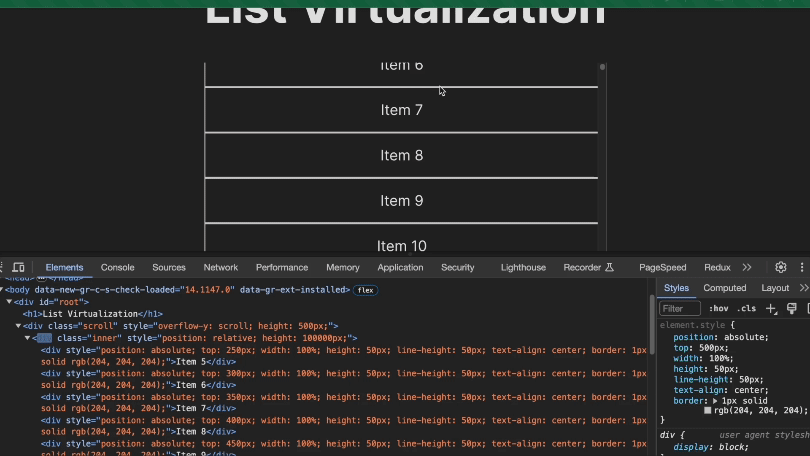

# List Virtualization

This is a project exploring how to render large lists in React apps more performantly.

## No Library Demo
我們假設list中每個item的高度都是相同的，那麽list的高度就會是list height * list count，這個總高度稱為inner height。另外，需要一個固定高度的window來渲染可視範圍內的list items，這個高度稱為window height。list在window可視範圍上方的高度稱為scrollTop。

建立一個SimpleVirtualizedList元件，裡面分成兩層，外層稱為scroll，用來監聽往下滾動的事件(scroll)，內層為inner，是一個position: relative的容器，高度就是innerHeight，裡面的list item用絕對定位定在容器上方，每個item都設一個相對於window的top定位。

這樣整個APP就只會渲染可視範圍內能容納的10個item，然後透過往下滾動，會繼續渲染接下來的10個item，直到list被滾動到下方沒有東西為止



## CSS Solution -- ```content-visibility: auto```
```content-visibility: auto``` 是一個2020年才加入的css屬性，可以讓瀏覽器在渲染時，選擇性地跳過不在可視範圍內的元素，不去計算它們的內容和佈局，會用placeholder來取代該元素。所謂跳過渲染內容是指：元素還是會出現在DOM上，但是因為尚未進入可視範圍，其子代不會被渲染，因此可優化初次渲染時的效能。但是使用這個方法有幾個缺點：一是往下滾動時scrollbar會出現抖動，另外如果某列表中有些元素設置``visibility: hidden``或``display:none``，在offscreen(出現在可視範圍外)時，因為瀏覽器會跳過渲染其樣式，因此他們仍會出現在DOM中。
補充：可以在list-item上另外加上```contain-intrinsic-size```，這是一個告訴瀏覽器元素不在可視範圍內時，placeholder的高度和寬度，可以稍微提高滾動時的效能。