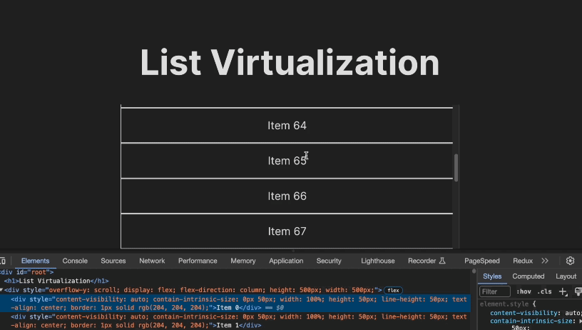

# List Virtualization

This is a project exploring how to render large lists in React apps more performantly.

## No Library Demo

我們假設 list 中每個 item 的高度都是相同的，那麽 list 的高度就會是 list height \* list count，這個總高度稱為 inner height。另外，需要一個固定高度的 window 來渲染可視範圍內的 list items，這個高度稱為 window height。list 在 window 可視範圍上方的高度稱為 scrollTop。

建立一個 SimpleVirtualizedList 元件，裡面分成兩層，外層稱為 scroll，用來監聽往下滾動的事件(scroll)，內層為 inner，是一個 position: relative 的容器，高度就是 innerHeight，裡面的 list item 用絕對定位定在容器上方，每個 item 都設一個相對於 window 的 top 定位。

這樣整個 APP 就只會渲染可視範圍內能容納的 10 個 item，然後透過往下滾動，會繼續渲染接下來的 10 個 item，直到 list 被滾動到下方沒有東西為止

## CSS Solution -- `content-visibility: auto`

`content-visibility: auto` 是一個 2020 年才加入的 css 屬性，可以讓瀏覽器在渲染時，選擇性地跳過不在可視範圍內的元素，不去計算它們的內容和佈局，會用 placeholder 來取代該元素。所謂跳過渲染內容是指：元素還是會出現在 DOM 上，但是因為尚未進入可視範圍，其子代不會被渲染，因此可優化初次渲染時的效能。但是使用這個方法有幾個缺點：一是往下滾動時 scrollbar 會出現抖動，另外如果某列表中有些元素設置`visibility: hidden`或`display:none`，在 offscreen(出現在可視範圍外)時，因為瀏覽器會跳過渲染其樣式，因此他們仍會出現在 DOM 中。
補充：可以在 list-item 上另外加上`contain-intrinsic-size`，這是一個告訴瀏覽器元素不在可視範圍內時，placeholder 的高度和寬度，可以稍微提高滾動時的效能。

